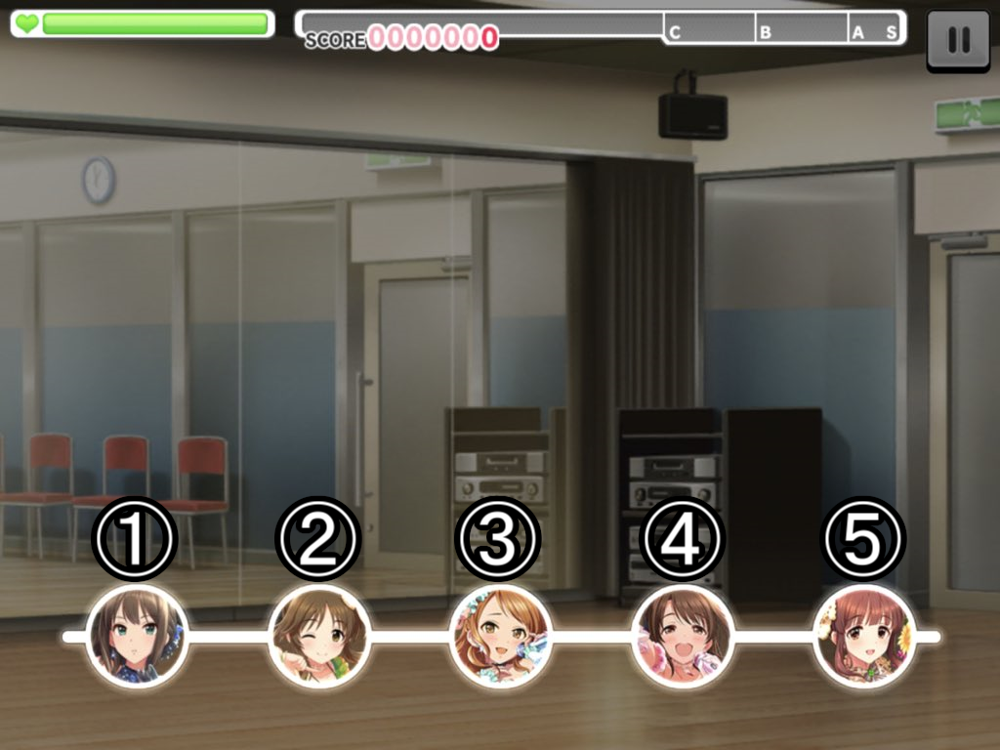

# beatmap（WIP）

3/23に更新されたリソースバージョン10037000において、Romantic Nowの譜面データに不具合があったので色々調べてみた。

| id   | sec      | type | startPos | finishPos | status | sync | groupId |
| ---- | -------- | ---- | -------- | --------- | ------ | ---- | ------- |
| 1    | 0        | 100  | 0        | 0         | 126    | 0    | 0       |
| 3    | 2.823529 | 1    | 2        | 5         | 0      | 0    | 0       |

上記表はRomantic Now(DEBUT)の譜面データの一部分である。

このデータを実機で再生するとレーン5に単押しノーツが1つ降ってくる。

ではこれを参考に色々検証してみるとする。

typeを2、3に変えた結果HOLDに関してのエラーが出た。

つまりtypeでノーツの種類を判別しているのだろうか。とはいえ3や4にしてもフリックは出なかった。

91、92は他のファイル見る辺り始点、終点だと思われる。

finishPosを4にしたところ下記画像の④の位置に単押しノーツが1つ降ってきた。

startPosは変えても何も変わらなかったので恐らく長押しノーツ用の設定だろうか。

