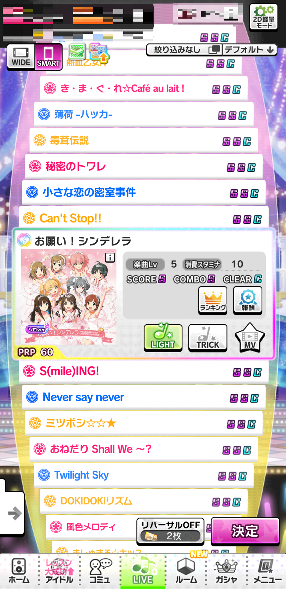

# length_mv

2nd Anniversary、そしてRES_VER_10036810を境にして縦MVがお亡くなりになられました。

それでも無理矢理縦MVを見る方法です。

まず、アセット内からmaster.mdbを探して開きます。

アセット名は全てSHA-1に変換されているのでmaster.mdbをSHA-1に変換し検索します。

そうすれば見つかることでしょう。

見つかったら[SQLite Browser](https://github.com/sqlitebrowser/sqlitebrowser)なりで開きます。(細かい操作方法は省略)

開いたら"live_data"というtableにします。

今回は"お願い！シンデレラ"を無理矢理縦にします。

詳しいことは省略しますが、以下と同じようにします。

| id   | music_data_id | sort | difficulty_1 | difficulty_2 | difficulty_3 | difficulty_4 | circle_type | live_bg | cyalume | chara_all_flag | type | sp_type | jacket_id | prp_flag | release_type | start_date          | end_date | event_type | difficulty_5 | member_number | difficulty_101 | v_mv | difficulty_11 | difficulty_12 |
| ---- | ------------- | ---- | ------------ | ------------ | ------------ | ------------ | ----------- | ------- | ------- | -------------- | ---- | ------- | --------- | -------- | ------------ | ------------------- | -------- | ---------- | ------------ | ------------- | -------------- | ---- | ------------- | ------------- |
| 1    | 1001          | 1    | 1            | 2            | 3            | 4            | 4           | 4004    | 4       | 1              | 4    | 0       | 1001      | 1        | 1            | 2015-03-01 15:00:00 |          | 0          | 565          | 5             | 0              | 1    | 843           | 844           |

他の楽曲で行う場合は[ここ](https://decrypt-lot.github.io/back_stage_cg/music_data/)でmusic_dataを確認すると良いでしょう。

書き換えたらそれを元のフォルダに上書きします。

Starlight Stageを起動し、フッターからLIVEを選択、SMARTに設定します。

成功したら上の画像のように本来はSMART LIVEに無いはずの"お願い！シンデレラ"が表示されています。

後は普通にMVを再生すればいいでしょう。

